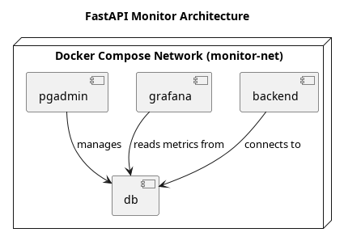

# Applications
This repository has the following applications
1. django101
2. fastapi-monitor

## django101
1. A sample repository to work with django

## fastapi-monitor
1. A containerized modular application used to visualise CPU and Memory usage metrics of a device on Grafana
2. A multi-container architecture that has the services -
    1. FASTAPI (Backend)
    2. POSTGRESQL (Database)
    3. Grafana (Visualization)
    4. PGAdmin (DB Management)

